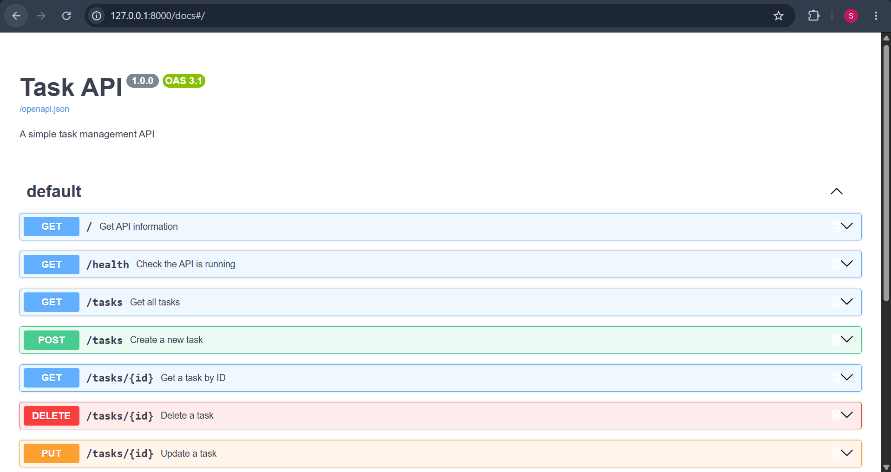
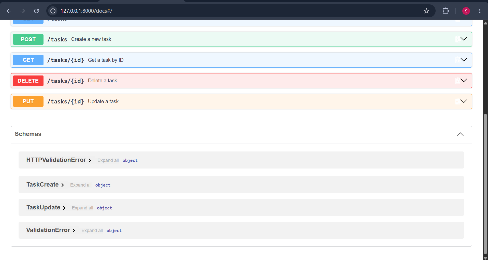

# Task API
I have built a task api which uses CRUD steps for a to do list a simple to do list which add uodate remove and take confirmation for task completion using boolean 

## Setup

git clone https://github.com/sres-092/Task-API.git
cd task-api
python -m venv venv
venv\Scripts\Activate.ps1 # Windows
source venv/bin/activate # Mac/Linux
pip install -r requirements.txt
fastapi dev main.py

Runs at http://127.0.0.1:8000 — interactive docs at /docs

## Endpoints

| Method | Path | Description |
|--------|------|-------------|
| GET | / | Get API information |
| GET | /health | Check the API is running |
| GET | /tasks | Get all tasks |
| GET | /tasks/{id} | Get a task by ID |
| POST | /tasks | Create a new task |
| PUT | /tasks/{id} | Update a task |
| DELETE | /tasks/{id} | Delete a task |
 
## Swagger UI

 
